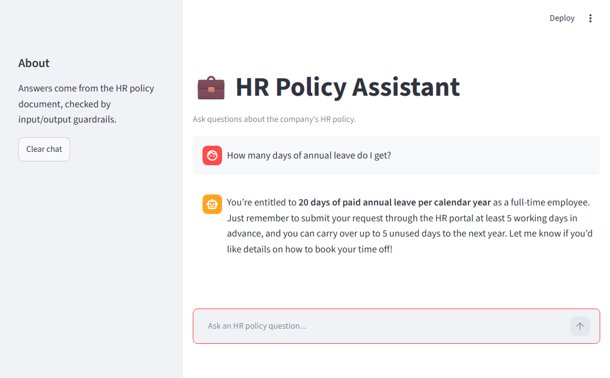
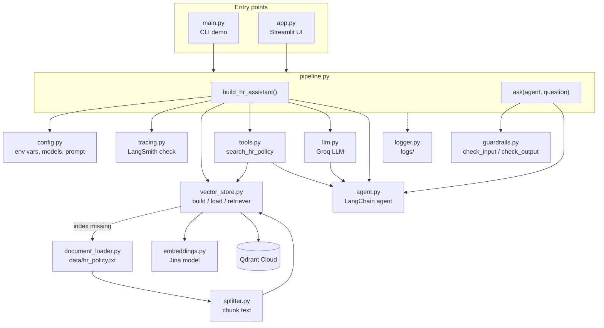

# HR Policy Assistant (RAG)

A retrieval-augmented generation (RAG) chatbot that answers employee questions about a company's HR policy document. Answers are grounded in the policy text retrieved from a vector database, and every question and answer passes through an LLM-based safety guardrail before it reaches the user.

## Screenshot



*The Streamlit UI (`streamlit run app.py`) answering "How many days of annual leave do I get?" from the retrieved policy text.*

## Technologies used

| Layer | Technology | Purpose |
|-------|------------|---------|
| Orchestration | [LangChain](https://www.langchain.com/) | Document loading, text splitting, retriever, tool and agent abstractions |
| Answer LLM | `openai/gpt-oss-20b` on [Groq](https://groq.com/) | Reasons over the question, decides to call the search tool, writes the final answer |
| Guardrail LLM | `openai/gpt-oss-safeguard-20b` on Groq | Screens user input and model output against safety policies |
| Embeddings | [Jina AI](https://jina.ai/) `jina-embeddings-v2-base-en` | Turns text chunks and queries into vectors |
| Vector store | [Qdrant Cloud](https://qdrant.tech/) | Stores chunk embeddings and serves similarity search (top-k = 3) |
| Observability | [LangSmith](https://smith.langchain.com/) + file logging | Traces agent/tool calls; logs written to `logs/` |
| UI | [Streamlit](https://streamlit.io/) | Chat interface (`app.py`) |
| Tooling | Python, `uv`, `python-dotenv`, Jupyter | Environment, config, experimentation |

Key settings live in `hr_assistant/config.py`: `CHUNK_SIZE=500`, `CHUNK_OVERLAP=60`, `TOP_K_RESULTS=3`.

## Architecture

### File-level flow

How the modules call each other, starting from the two entry points.



### RAG process

What happens at startup (ingestion) and on every question (query time).

```mermaid
flowchart TD
    subgraph Ingest["1. Ingestion (first run only)"]
        A["hr_policy.txt"] --> B["Split into chunks<br/>500 chars, 60 overlap"]
        B --> C["Embed chunks<br/>Jina v2"]
        C --> D[("Qdrant collection<br/>hr_policy")]
    end

    subgraph Query["2. Query time"]
        Q["User question"] --> IG{"Input guardrail<br/>safe?"}
        IG -- No --> R["Refusal message"]
        IG -- Yes --> AG["Agent<br/>gpt-oss-20b"]
        AG -->|calls tool| T["search_hr_policy"]
        T --> E["Embed query<br/>Jina v2"]
        E --> S["Similarity search<br/>top-3 chunks"]
        D --> S
        S -->|context| AG
        AG --> ANS["Draft answer"]
        ANS --> OG{"Output guardrail<br/>safe?"}
        OG -- No --> R
        OG -- Yes --> OUT["Answer shown to user"]
    end
```



On later runs the existing Qdrant collection is detected (`vector_store_exists()`) and reused, so the document is not re-embedded.

### Step by step

1. **Ingest** — `document_loader.py` loads `data/hr_policy.txt`; `splitter.py` splits it into overlapping chunks.
2. **Embed & store** — `embeddings.py` creates Jina embeddings; `vector_store.py` uploads them to Qdrant Cloud, or loads the existing collection.
3. **Retrieve** — `tools.py` wraps the retriever (top-k = 3) as a `search_hr_policy` tool.
4. **Agent** — `agent.py` builds a LangChain agent on Groq's `openai/gpt-oss-20b` that calls the search tool to ground its answers.
5. **Guardrails** — `guardrails.py` asks a separate safety model to screen the question (prompt injection, requests for other employees' data) and the answer (PII leaks, unauthorized promises, suspicious links). Unsafe content returns a fixed refusal message.
6. **Wiring** — `pipeline.py` (`build_hr_assistant()` / `ask()`) connects everything and is used by both entry points.

## Entry points

- `python main.py` — CLI demo that asks a few sample HR questions.
- `streamlit run app.py` — interactive chat UI.
- `rag.ipynb` — notebook version for experimentation.

## Project layout

```
hr_assistant/
  config.py          settings, env vars, system prompt
  document_loader.py load the HR policy text file
  splitter.py        chunk the document
  embeddings.py      Jina embeddings model
  vector_store.py    Qdrant Cloud build/load/retriever
  tools.py           search tool for the agent
  llm.py             Groq LLM setup
  agent.py           LangChain agent construction
  guardrails.py      input/output safety checks
  pipeline.py        wires everything together (build_hr_assistant, ask)
  logger.py          file logging (logs/)
  tracing.py         LangSmith tracing check
data/hr_policy.txt   source HR policy document
docs/images/         README screenshots
```

## Setup

1. Install [uv](https://github.com/astral-sh/uv):
   ```
   pip install uv
   ```
2. Create and activate a virtual environment:
   ```
   uv venv ragenv
   ragenv\Scripts\activate
   ```
3. Install dependencies:
   ```
   uv pip install -r requirements.txt
   ```
4. Create a `.env` file with:
   ```
   GROQ_API_KEY=...
   JINA_API_KEY=...
   QDRANT_URL=...
   QDRANT_API_KEY=...
   QDRANT_COLLECTION_NAME=hr_policy
   LANGSMITH_TRACING=false
   LANGSMITH_ENDPOINT=...
   LANGSMITH_API_KEY=...
   LANGSMITH_PROJECT=...
   ```
5. Run it:
   ```
   python main.py
   streamlit run app.py
   ```

## Git basics

```
git add .
git commit -m "Some message"
git push
```
